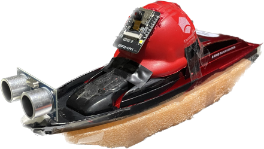
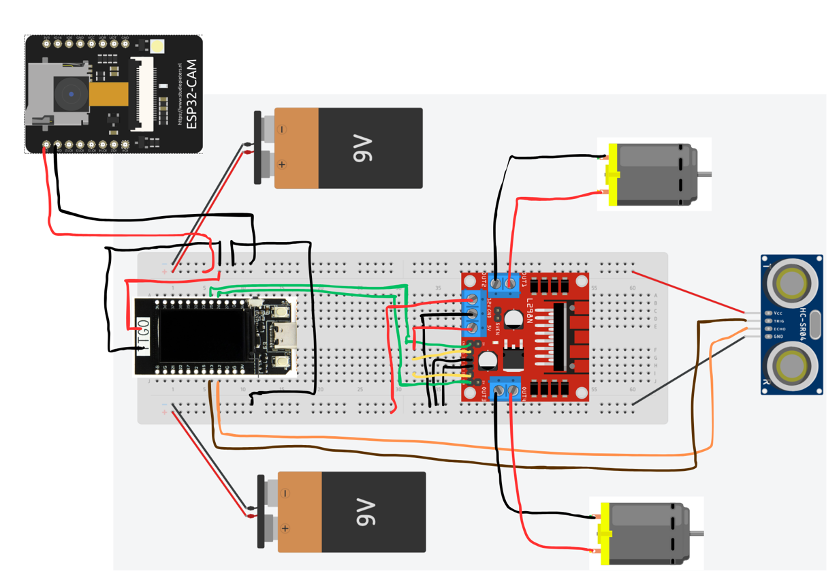

# Autonomous Boat
## Description

An embedded system project of building an autonomous boat that tracks a red blob and stops when an obstacle is detected.

## Features
- Drive straight towards a red blob (if none is visible, stop the motors).
- Avoid forward collision by reading the sensor and stopping in time.

## Tools
### Hardware
- T-Display 16MB CH9102F 
- ESP32-CAM
- OV2640
- HC-SR04 ultrasonic distance sensor
- Breadboard
- Jump wires
- L289N motor driver
- 4-AA battery holder
- Kmart 1:14 Series Radio Control Super Speed Boat

#### Connection diagram

### Software
The code is written using [Arduino](https://www.arduino.cc/en/software). 

Setup and upload steps are available in [setup.txt](./setup.txt).

## Acknowledgment
- Embedded Robotics by Thomas Bräunl
