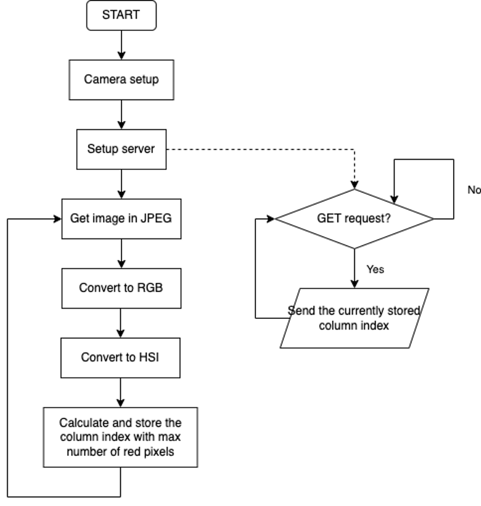

# Camera
This [code](./esp32Cam.ino) is to be uploaded to ESP32-CAM.

Current code is setup to detect the colour red defined by hueTarget. 
- Change hueTarger as desired to detect other colours.
- Change hurOffset as desired to decrease or increase the detection spectrum.

## Logic diagram

## Colour detection algorithm
The colour detection algorithm is adapted from Embedded Robotics by Thomas Bräunl.
